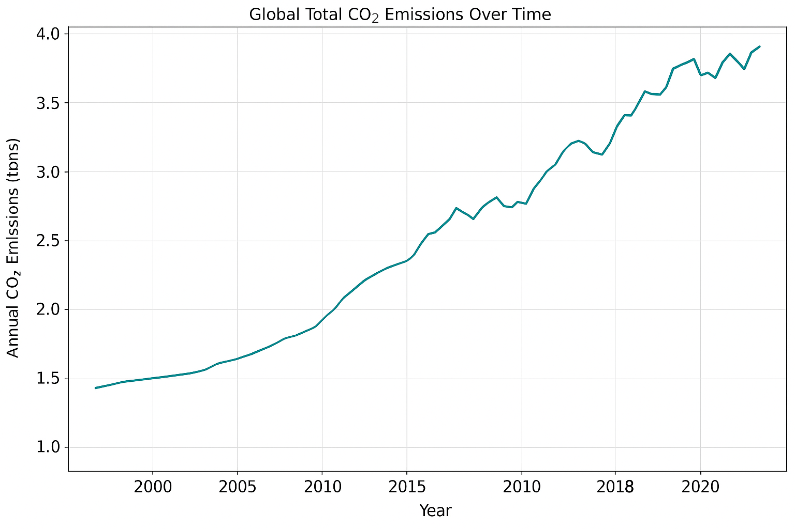

# SupplyChain-CO2-Analysis
## Overview

This project focuses on analyzing CO₂ emissions across supply chain sectors using multiple datasets. By integrating emission factors and applying the GLEC Framework, the analysis identifies key emission hotspots and offers insights to optimize transportation and logistics for sustainability.

## Motivation

- 🌍 Climate concerns have made emissions tracking across supply chains a necessity.
- 📦 Key contributors include electricity production, manufacturing, road freight, and maritime shipping.
- ♻️ The goal is to derive insights that support decision-making toward sustainable logistics and procurement.

## 🗂️ Table of Contents

- [Overview](#overview)
- [Motivation](#motivation)
- [Data Sources](#data-sources)
- [Data Flow Diagram](#data-flow-diagram)
- [Methodology](#methodology)
- [Visual Insights](#visual-insights)
- [Key Takeaways](#key-takeaways)
- [Technologies Used](#technologies-used)
- [Future Scope](#future-scope)

## Data Sources

- **CO₂ Emissions by Sector** (Our World in Data)
- **Freight & Container Transport Data** (2000–2020)
- **GHG Emission Factors Dataset** (CO₂, CH₄, N₂O)
- **GLEC Framework** for standardized transport emissions mapping

##  Data Flow Diagram 
This diagram illustrates how data flows through the project — from raw collection to final analysis and actionable outputs.

 ## Methodology
 
### 🔧 1. Data Cleaning & Preprocessing
- Standardized country names and transport mode categories for consistency.
- Handled missing values and removed duplicates to ensure clean, reliable data.
- Merged multiple datasets — including CO₂ emissions, GHG emission factors, and freight/container transport data — based on country and year (2019–2020) to build a unified dataset.

### ⚗️ 2. Emission Factor Application
- Applied GHG emission factors (CO₂, CH₄, N₂O) to convert raw emission values into CO₂-equivalent (CO₂e).
- Standardized emissions measurement using Global Warming Potential (GWP) multipliers to enable cross-comparisons between gases.

### 📊 3. Exploratory Data Analysis & Visualization
- **Sector-wise analysis**: Identified top-emitting sectors such as transport, electricity & heat production, manufacturing, and bunker fuels.
- **Transport mode comparison**: Compared emissions from road, rail, maritime, and air freight using both freight and container datasets.
- **Geographical analysis**: Highlighted top CO₂-emitting countries and tracked regional emission trends over time.
- Used bar charts, line graphs, and stacked visuals to highlight high-impact areas.

### 🔍 4. Supply Chain Impact Assessment
- Mapped emissions to major supply chain stages:
  - Sourcing & Procurement
  - Production
  - Logistics & Transportation
  - Distribution & Last-Mile Delivery
- Assessed the most emission-intensive activities and recommended:
  - Shifting freight from road to rail
  - Integrating renewable energy into electricity-heavy processes
  - Transitioning maritime shipping to cleaner fuels
 
##  Visual Insights
### 🌍 Global CO₂ Emissions Over Time  

Shows the rise in global CO₂ emissions across decades.  
Highlights the need for global efforts in carbon reduction across all industries.

### 🏭 CO₂ Emissions by Sector with Fluctuations (2010–2020)  

Shows emission contributions by key sectors like transport, electricity, and construction.  
Reveals which parts of the supply chain are most carbon-intensive over time.

### 🚚 Year-wise Emissions by Freight Mode (2010–2020)  

Tracks CO₂ emissions from road, rail, air, and maritime freight over 11 years.  
Highlights road and maritime shipping as dominant contributors requiring optimization.

## Key Takeaways

### 🔌 Sourcing & Procurement
- Electricity and heat production generate the most emissions.
- Urgent need for sustainable sourcing of energy and raw materials.

### 🚛 Logistics & Transportation
- Road freight is the most polluting transport mode.
- Optimization strategies: route planning, fuel efficiency, electric vehicles.

### 🛳️ Maritime Transport
- Bunker fuels used in shipping are major contributors.
- Push for cleaner fuels: LNG, biofuels, hydrogen.
  
##  Technologies Used

- Python (Pandas, NumPy, Seaborn, Matplotlib)
- Jupyter Notebook
- GLEC Framework Logic
- CO₂e Computation using GWP values

  
## Future Scope

- Integrate fuel-type-specific datasets
- Predictive modeling for CO₂ trend forecasting
- Dashboard for sustainability KPIs
- Region-specific sustainability planning tools

